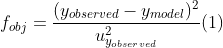

# Calculation Engine for Parameter Estimator with Uncertainty - MT_PEU

<p align="justify">
The MT_PEU is an open-source calculation engine developed for parameter estimation of linear and non-linear steady-state models in the presence of uncertainty on the observed data. Additionally, the MT_PEU performs statistical evaluations regarding the quality of the estimation, i.e. how well the model describes the observed data, using: (i) coverage region of parameters, (ii) hypothesis testing on residues.</p>

<p align="justify">
MT_PEU builts on two main classes (EstimacaoNaoLinear and EstimacaoLinear), whose methods allow: (i) <i>optimization</i> (parameter estimation); (ii) <i>evaluation of parameter uncertainty</i> (including the coverage region); (iii) <i>evaluation of  prediction model estimates and its uncertainty</i>; and (iv) <i>residual analysis</i> (important to evaluate the model quality).
</p>

# Functionalities

<p align="justify">
This calculation engine is based on Python programming language and builts on a class structure, which main functionalities are, namely:
</p>

* **Inclusion of different datasets**
  <p align="justify"> It allows to insert observed datasets, obtained experimentally, both for parameter estimation and validation purposes. </p>

* **Model parameter estimation**
  <p align="justify">
    <text> The parameters are obtained through the solution of an optimization problem, which cost function is a weighted least squares: </text>  </p>
  <p align="center">
  
  </p>
  <p align="justify">The optimization routines were developed by symbolic computation using the <i>casadi</i> package. The following algorithms are available: (i) <i>ipopt</i>, based on interior point primal-dual method and indicated for large dimension nonlinear problems; and (ii) <i>sqpmethod</i>, which uses sequential quadratic programming. Regarding linear models on the parameters, the solution is obtained analytically.</p>
  
  The MT_PEU is applicable for the following systems: SISO, MISO, and MIMO.

* **Parameter uncertainty evaluation**
  <p align="justify"> The evaluation of parameter uncertainty is carried out after the optimization step and can be performed through three methods:</p>

  * Geral, based on the sensibility of the objective function to small variations in the parameters at the optimal point.

  <p align="center">
  
  </p>

  * 2InvHessiana, based on an approximation of (1):

  <p align="center">
  
  </p>

  * SensibilidadeModelo, based on an approximation of (1):
  <p align="center">
  
  </p>

    <p align="justify">It's recommended to compare the parameter covariance matrix obtained by each method, in order to ensure that the results are consistent.</p>

* **Uncertainty evaluation for the estimated outputs**

  <p align="justify"> The model prediction as well as the associated uncertainty is evaluated based on estimated parameters and experimental dataset:	</p>

  <p align="center">
  
  </p>

* **Residual analysis**
  <p align="justify">
    <text> It is used to evaluate the residues (the difference between observed and predicted values) in order to check the statistical significance for the results (hypothesis validation). 
          The residues are evaluated by statistical testing according to its desired behavior, i.e. hypotheses imposed to obtain the objective function: (i) normality, (ii) zero mean, (iii) autocorrelation, and (iv) homoscedasticity. 
          Additionally, it is also evaluated if the optimum objective function remains inside the statistical interval, following the chi-square distribution.</text>
  </p>

* **Graphs and reports export**

  <p align="justify"> In order to provide a better view of the obtained results the MT-PEU offers charts and reports, which can be requested anywhere in the code.</p>

  * <p align="justify">There are three type of  <b>reports</b> available: (i) <i>optimization</i>, that describes the optimization procedure; (ii) <i>parameters</i>, that contains the values, covariance matrix and uncertainties obtained for the estimated parameters; and (iii) <i>prediction</i>, which presents the results of residual analysis.</p>

  * <p align="justify">There are many graphs and charts available in MT-PEU, for example: (i) <i>tendency</i>, (ii) <i>boxplot</i>, (iii) <i>autocorrelation</i>, (iv) <i>correlation matrix</i> and (iv) <i>coverage region of parameters</i>(likelihood and the one assuming that parameters follow a normal distribution).</p>

    <p align="justify"> Figure 1 shows some examples of graphs produced by MT-PEU .</p>

<p align="center">
    
    
</p>

<p align="center">
    
    
</p>

# How to install

<p align="justify"> To use MT-PEU it's necessary to have <b>Python 3</b> installed with the following packages:

* numpy - version 1.16.2 (available in **anaconda** distribution)
* scipy - version 1.2.0 (available in **anaconda** distribution)
* matplotlib - version 3.1.1 (available in **anaconda** distribution)
* statsmodels - version 0.9.0 (available in **anaconda** distribution)
* casadi - version 3.4.5 (may be installed by pip: **pip install casadi**)

*The easiest way to install the Python 3 and the referred packages is through the anaconda distribution*: https://www.anaconda.com/distribution/
*After installing the Anaconda distribution, one can use the Anaconda Prompt and install casadi through the command: **pip install casadi**.*

Finally, one can download the MT-PEU files at https://github.com/ddss/MT_PEU/archive/Teste.zip and, through a code Editor, like PyCharm, use the engine. A
simplest way to use MT-PEU is through the Jupyter Notebook - just start the Jupyter at Anaconda Navigator and using the interface lookfor ".ipynb" files in the MT-PEU folder.

# Getting Started

We have included examples to help users in using the MT-PEU. The most *detailed examples are
presented using the Jupyter framework*, so just start the jupyter (actually a jupyter server) at 
Anaconda Navigator, and through the interface (it will open in your browser) open one of the files Exemplo_1.ipynb to Exemplo_5.ipynb.

The same examples are presented in simple .py files to be used in code editors.

To exemplify the usage of MT-PEU, let's reproduce the Example_1.py file:
```python

# packages imports
from MT_PEU import EstimacaoNaoLinear
from numpy import exp

# model definition
def Modelo(param,x,*args):

    ko, E = param[0], param[1]
    tempo, T = x[:,0], x[:,1]

    return exp(-(ko*10**17)*tempo*exp(-E/T))

# class initializing
Estime = EstimacaoNaoLinear(Modelo, simbolos_x=['t','Tao'], simbolos_y=['y'], simbolos_param=['ko','E'], Folder='Exemplo1')

# dependent quantity observed data
y = [0.9,0.949,0.886,0.785,0.791,0.890,0.787,0.877,0.938,
0.782,0.827,0.696,0.582,0.795,0.800,0.790,0.883,0.712,0.576,0.715,0.673,
0.802,0.802,0.804,0.794,0.804,0.799,0.764,0.688,0.717,0.802,0.695,0.808,
0.655,0.309,0.689,0.437,0.425,0.638,.659,0.449]

# independent quantity observed data
tempo = [120.0,60.0,60.0,120.0,120.0,60.0,60.0,30.0,15.0,60.0,
45.1,90.0,150.0,60.0,60.0,60.0,30.0,90.0,150.0,90.4,120.0,
60.0,60.0,60.0,60.0,60.0,60.0,30.0,45.1,30.0,30.0,45.0,15.0,30.0,90.0,25.0,
60.1,60.0,30.0,30.0,60.0]

# independent quantity observed data
temperatura = [600.0,600.0,612.0,612.0,612.0,612.0,620.0,620.0,620.0,
620.0,620.0,620.0,620.0,620.0,620.0,620.0,620.0,620.0,620.0,620.0,620.0,
620.0,620.0,620.0,620.0,620.0,620.0,631.0,631.0,631.0,631.0,631.0,639.0,639.0,
639.0,639.0,639.0,639.0,639.0,639.0,639.0]

uy = [1]*41; uxtempo = [1]*41; uxtemperatura = [1]*41

# passing data to the MT_PEU
Estime.setDados(0,(tempo,uxtempo),(temperatura,uxtemperatura))
Estime.setDados(1,(y,uy))

# setting the dataset
Estime.setConjunto(tipo='estimacao')

# plotting a graph with observed data
Estime.graficos()

# executing the parameter estimation process
Estime.optimize(initial_estimative=[0.5,25000], algoritmo='ipopt')

# calculating parameters uncertainty
Estime.incertezaParametros(metodoIncerteza='Geral')

# model's predictions
Estime.predicao()

# residuals analysis
Estime.analiseResiduos()

# plotting graphs with residuals analysis and predicted data
Estime.graficos()
```

# References
This project is based in:

* BARD, Y. Nonlinear parameter estimation. New York: Academic Press, 1974
* SCHWAAB, M. M.; PINTO, J. C. Análise de Dados Experimentais I: Fundamentos da Estatística e Estimação de Parâmetros. Rio de Janeiro: e-papers, 2007.
